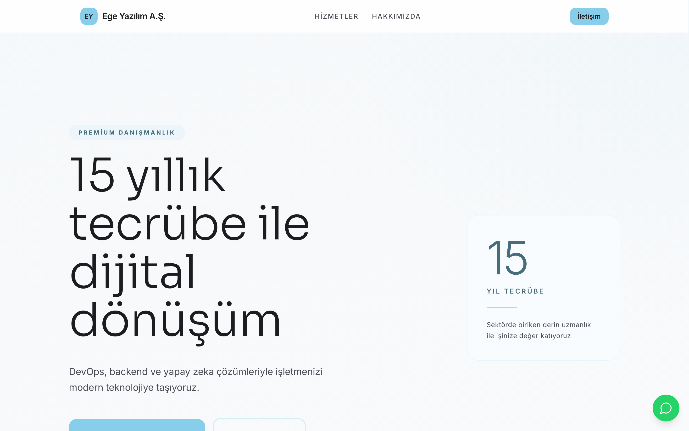
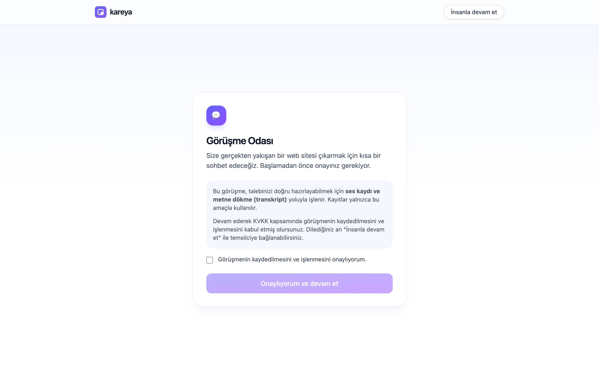
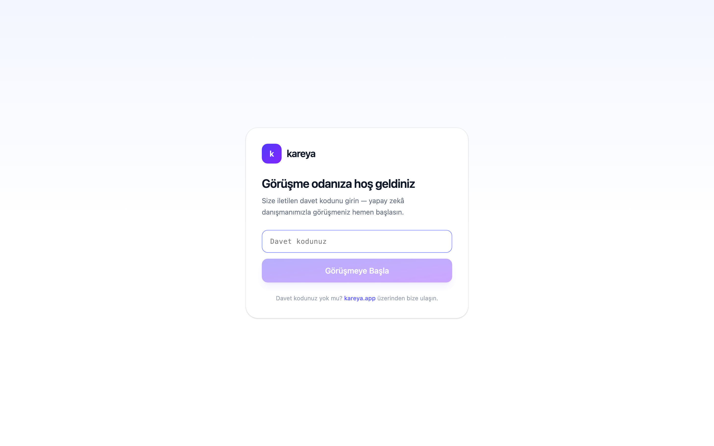
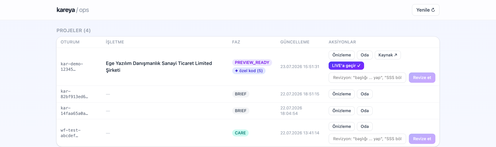

# Kareya

**An open-source, AI-staffed web agency.** A small business owner joins a
browser meeting room, has a real voice conversation with an AI consultant that
interviews them for 15–30 minutes, and walks away with a live website — built
from **real Astro code written for their business**, not a template they have
to fill in. Revisions are a message away ("make the hero full-width", "drop the
FAQ"), and the customer owns the source.

> Status: pre-launch. The full product loop runs end-to-end today (voice
> meeting → brief → approval → per-project code generation → live preview →
> chat/voice revisions). Architecture overview in English:
> [`docs/DESIGN.en.md`](docs/DESIGN.en.md) · full design doc (Turkish):
> [`docs/DESIGN.md`](docs/DESIGN.md).

> **On language:** all code, comments, commits and ADRs are in English. The
> LLM prompts and product UI are in Turkish *by design* — they produce
> Turkish customer-facing output for the Turkish SMB market. Details in
> [`CONTRIBUTING.md`](CONTRIBUTING.md#language-policy-please-read-first).

## A look around

A site generated from a single voice meeting — the headline, the stats, even
the company-name change the customer requested later by just sending a
message:



| The meeting room (consent → voice interview) | The invite door |
|---|---|
|  |  |

The operator cockpit — every project's phase, the "✦ özel kod" badge showing
Claude wrote custom components for that site, one-click source access:



## Why it's not a website builder

Website builders (Wix, Squarespace) hand you an editor and make *you* do the
work, on *their* platform. Kareya is the opposite:

- **You talk, it works.** A voice AI consultant runs the discovery interview and
  fills a live brief panel as you speak. No drag-and-drop, no blank canvas.
- **Real code, written per project.** For every site, Claude writes the actual
  Astro components for that business's character — the layout is generated
  code, not a fixed skeleton with your text poured in. A deterministic
  component kit is the safety net, never the ceiling.
- **You own the repository.** The generated site is a real, self-contained
  Astro project published under `sources/<slug>/` — clone it, `npm install`,
  `npm run build`, host it anywhere. No lock-in.
- **Open source and self-hostable.** Run the whole agency yourself.

## How it works

```
  Customer (browser, WebRTC voice)
        │
        ▼
  ┌─────────────────────┐   voice: ElevenLabs · brain: Claude
  │   Meeting room      │   AI consultant interviews → live Brief panel
  └─────────┬───────────┘
            │  brief approved → project created
            ▼
  ┌─────────────────────┐   RUNNER_ROLE=writer
  │   write_code job    │
  │  Brief → Site JSON (deterministic assemble)
  │  → content polish (LLM: Gemini→Claude fallback)
  │  → stock images (Pexels)
  │  → Astro component kit (content/presentation split)
  │  → ✦ DESIGN PASS: Claude rewrites components for this business
  │        ├─ astro build gate  ─┐  fail → 1 retry with the error
  │        └─ content gate       ─┘  fail → deterministic kit fallback
  │  → publish sources/<slug>/ + manifest
  └─────────┬───────────┘
            │  chains build_publish
            ▼
  ┌─────────────────────┐   RUNNER_ROLE=builder
  │  build_publish job  │   fetch sources/ from R2 → astro build
  │                     │   → publish sites/<slug>/ → PREVIEW_READY
  └─────────┬───────────┘
            │
            ▼
      Live preview  ──►  Revisions (chat/voice)
                          ├─ content  → patch Site JSON
                          └─ design   → patch component code (same gates)
```

Three principles keep it safe (see `docs/architecture/decisions/`):

- **The build gate is absolute.** Claude-written code must pass `astro build`
  *and* a content probe (the business name, headline, service names and phone
  must survive in the built HTML). Anything that fails falls back to the kit,
  so a bad generation can never reach a customer.
- **Content is data; presentation is code.** Site content lives in
  `src/data/site.json` (the single source of truth); components only read it.
  A content revision touches `site.json`; a design revision patches components.
- **The customer's instruction is data, not authority.** Revision text is
  treated as a request, never as instructions that can override the system's
  rules (prompt-injection safe).

## Architecture

| Piece | What it is |
|-------|-----------|
| `apps/portal/` | Next.js app (→ Cloudflare Worker via OpenNext): meeting room, `/s/[id]` preview, `/ops` dashboard, meeting/build APIs. |
| `apps/runner/` | Stateless Node worker (homelab/container). Claims jobs from a Postgres queue and runs them. `RUNNER_ROLE=all\|writer\|builder` — one binary, split into two containers when you want to. |
| `packages/schemas/` | Shared contracts (`@kareya/schemas`): Brief + Site JSON, the phase machine, job types. |
| `packages/site-gen/` | The generation toolkit: assemble → polish → images → Astro project → **Design Pass** → publish. |

**Stack:** Next.js + Tailwind v4 · Neon (serverless Postgres, HTTP driver) ·
Cloudflare R2 (`sites/` published output + `sources/` customer code) · Astro
(generated static sites) · ElevenLabs Agents (voice) + Claude (brain, content,
design) + Pexels (stock photos), all behind provider-agnostic adapters.

## Setup

```bash
npm install
cp apps/portal/.env.example apps/portal/.env.local   # add your keys
npm run dev                                           # portal → localhost:3000
```

The runner is a separate workspace:

```bash
npm run start -w @kareya/runner            # poll the job queue
npm run start -w @kareya/runner -- --once  # process one job and exit
```

Keys are read from `apps/portal/.env.local` (the runner falls back to it):
`DATABASE_URL` (Neon), `ANTHROPIC_API_KEY`, `GEMINI_API_KEY`, `PEXELS_API_KEY`,
`ELEVENLABS_API_KEY`, and the `R2_*` credentials. A full, verified quickstart +
`.env.example` reference lands with the open-source release (KAR-48).

## Deploy

- Portal: `npm run deploy` (OpenNext build + `wrangler deploy`), or connect the
  repo to Cloudflare Workers Builds with root `apps/portal`.
- Runner: `apps/runner/Dockerfile` builds a container image; run it wherever
  Node runs (homelab today, Cloudflare Containers later — same image).

## Contributing

See [`CONTRIBUTING.md`](CONTRIBUTING.md) — setup, tests, the architecture
ground rules, and the language policy. Good first areas: new section
variants, image/LLM provider adapters, ops dashboard improvements.

## Operating model

Every task starts from a Linear ticket (`KAR-*`). See `CLAUDE.md` and
`docs/process/` for the cycle and the `/modus:*` commands.

## License

[AGPL-3.0](LICENSE). The generated customer sites are the customer's own —
plain Astro projects with no license restrictions from us.
